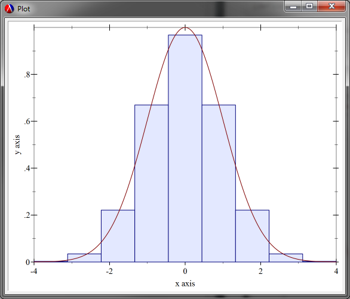

# Final Project Assignment 1: Exploration (FP1) 
DUE March 25, 2015 Wednesday (2015-03-25)


### My Library: Plot
Brian Carlson
 
a narrative of what you did

 I chose to explore the `Plot` library. This library handles 2D and 3D graphing renders in Racket. I browsed around at some of the functionality that was available with the library, and what types of graphs you could make. They give very detailed information on how to use their procedures, and many of them. I first looked at some different 2D graph types, you can make a simple plot by invoking the following:
 
 ```
(require plot) ; Plot library
(plot-new-window? #t) ; Provides a separate window outside of the interpreter

(define (square x) (* x x)) ; simple function to graph

> (plot (function square (- 10) 10 #:label "square(x)" ) )

 ```
 
  Plot Window.")
 
 This call to plot provides an x-range of -10 to 10, and a label of the line being graphed. The plot can also be zoomed in on and moved around.
 
 Other graph types are available as well, such as histograms/bar charts. There was a pretty neat example that estimated the area under a curve using a sequence of histograms.
 
 ```
 
 (require (only-in plot/utils linear-seq))
 (define (f x) (exp (* -1/2 (sqr x))))
 (plot (list (area-histogram f (linear-seq -4 4 10))
               (function f -4 4)))
			
```



This was a pretty cool interplay of the graphs and possibilities of data acquisition from them. There are also some nice isometric 3D renders that can be made as well. They had another cool example of histogram over numerous axis, representing a type of force displacement.


Overall, this library provides a very straight forward, easy to understand procedures and utilities for graphing simple or complex data, quickly and easily.